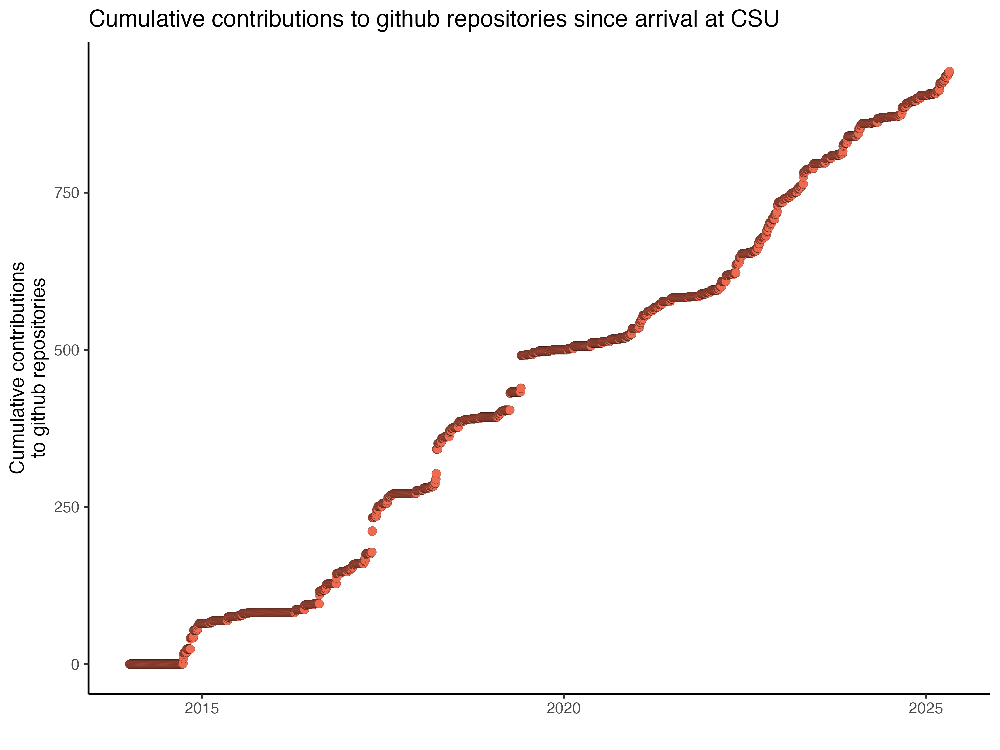

# How to collect and plot github contributions data

Mark Stenglein
4/30/2025

## Motivation

Part of being an academic scientist is documenting your activities.  I like to collect and plot quantitative data that reflects my contributions to science.  I do a lot of computational work, so one measure of my productivity is "contributions" to github repositories.  Contributions include things like code commits, opening an issue, etc.  [See here for more info](https://docs.github.com/en/account-and-profile/setting-up-and-managing-your-github-profile/managing-contribution-settings-on-your-profile/viewing-contributions-on-your-profile#what-counts-as-a-contribution).

This snippet documents how I collected and plotted my total contributions to github repositories since I started as a faculty at CSU in the fall of 2014.

## Collecting contribution data

I used the [GitHub GraphQL API](https://docs.github.com/en/graphql) to access and download this data. This is how I collected my contribution data for each year since 2014.. 

1. Navigate to the [GraphQL API Explorer](https://docs.github.com/en/graphql/overview/explorer):
https://docs.github.com/en/graphql/overview/explorer
2. Click the "Sign in with Github" link to sign in using your github credentials.
3. In the query box, enter in a query like the one shown below, which will get your contribution data for 2023.  Note the data range.  You are only allowed to have the date range span one year, so you will have to repeatedly enter the query to get 1-year's worth of data at a time.  Save the resulting data in a .json file.  In this example, I am collecting contribution data from 2023 and I will save it in a file named 2023.json.

```
query($userName:String!) {
  user(login: $userName){
    contributionsCollection (
      from:"2023-01-01T00:00:00.000Z",
      to:  "2023-12-31T23:59:59.000Z") {
      contributionCalendar {
        totalContributions
        weeks {
          contributionDays {
            contributionCount
            date
          }
        }
      }
    }
  }
}
```

You will also need to enter in the Variables section of the interface something like:

{ "userName": "stenglein-lab"}

Replacing stenglein-lab with your github username.

At the end of this you should have one .json file for each year's worth of data, with names like `2014.json` or `2019.json`.

## Plot data

I used R to wrangle and plot this data.  The data is in separate .json files so I used the tidyjson package to convert the .json contribution data into a concatendated tidy dataframe, which I then plotted.  You will need the tidyverse and tidyjson packages installed.

The R code I used is:
```{r}
library(tidyverse)
library(tidyjson)

# process and plot github contribution data
# Mark Stenglein 4/30/2025

# this function process one year's worth of github contribution data.
# It assumes there is a file named <year>.json
# that contains data exported from the github GraphQL API as described above
process_one_year <- function(year) {
  
  filename = paste0(year, ".json")
  contributions <- read_json(filename)
  
  # dig down through the json data structure to get at the data we want
  weeks <- contributions %>% 
    enter_object(data) %>% 
    enter_object(user) %>% 
    enter_object(contributionsCollection) %>%
    enter_object(contributionCalendar) %>%
    enter_object(weeks) 
  
  # continue to dig into json data structure
  days <- weeks %>%
    gather_array %>%
    enter_object(contributionDays) %>%
    gather_array("index.2")
  
  # turn into a tidy data frame (tibble)
  contribution_counts <- days %>% spread_all %>% select(contributionCount, date, -..JSON)
  contribution_counts <- as_tibble(contribution_counts)
  
  # return it
  contribution_counts

}


# process all the years
years <- seq(2014, 2025)

# this line of code does 2 things: it calls the above function on the vector of years using lapply
# lapply returns a list of tibbles, which we want to concatenate into a single tibble
# use bind_rows to concatenate all the individual tibbles in the list
all_year_data <- bind_rows(lapply(years, process_one_year))

# tabulate cumulative sum of contributions
all_year_data <- all_year_data %>% mutate(cumulative_contributions = cumsum(contributionCount))

# make sure data column is in a data format, using lubridate as_date
all_year_data$date <- as_date(all_year_data$date)

# plot cumulative contributions
ggplot (filter(all_year_data, date < today())) +
  geom_point(aes(x=date, y=cumulative_contributions), 
             shape=21, size=3, fill="coral2", color="black", stroke=0.05) +
  theme_classic(base_size = 14) +
  xlab("") +
  ylab("Cumulative contributions\nto github repositories") +
  ggtitle("Cumulative contributions to github repositories since arrival at CSU")

# save as a PDF
ggsave("cumulative_github_contributions.pdf", units="in", width=10, height=7.5)
ggsave("cumulative_github_contributions.png", units="in", width=10, height=7.5)
```

This produces this plot:



I've made nearly 1000 github contributions over the last 10 years, which I feel pretty good about.
