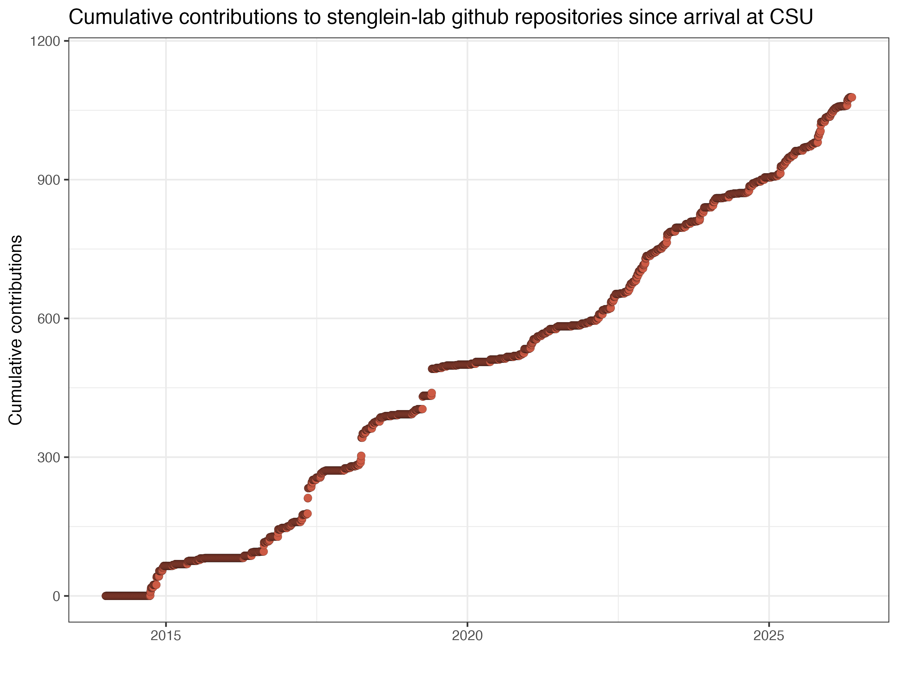

# How to collect and plot github contributions data

Mark Stenglein
updated: 5/19/2026

## Motivation

Part of being an academic scientist is documenting your activities ad nauseam.  I like to collect and plot quantitative data that reflects my contributions to science.  I do a lot of computational work, so one measure is "contributions" to github repositories.  Contributions include things like code commits, opening an issue, etc.  [See here for more info](https://docs.github.com/en/account-and-profile/setting-up-and-managing-your-github-profile/managing-contribution-settings-on-your-profile/viewing-contributions-on-your-profile#what-counts-as-a-contribution).

This snippet documents how I collected and plotted my total contributions to github repositories since I started as a faculty at CSU in the fall of 2014.

## Collecting contribution data

The [fetch_github_contribution_info.sh script](./fetch_github_contribution_info.sh) retrieves github contribution data.  You need to specify your github username and a [personal access token](https://docs.github.com/en/authentication/keeping-your-account-and-data-secure/managing-your-personal-access-tokens). This script uses the [GitHub GraphQL API](https://docs.github.com/en/graphql) to retrieve information.  

To get more information for running this script, run:

```
./fetch_github_contribution_info.sh -h
```

Which will output this usage information:

```
Usage: fetch_github_contribution_info.sh [OPTIONS]

Query the GitHub GraphQL API for contribution calendar data.
Outputs one raw JSON blob per year to stdout.

Options:
  -u, --username USERNAME   GitHub username to query (required)

  -t, --token TOKEN         GitHub personal access token (required)

  -y, --year YEAR           Year to retrieve (can be specified multiple times,
                            e.g. -y 2022 -y 2023); defaults to the current year

  -h, --help                Show this help message and exit

Examples:
  # Single year using made-up access token
  fetch_github_contribution_info.sh -u stenglein-lab -t ghp_abc123 -y 2023

  # Multiple years
  fetch_github_contribution_info.sh -u stenglein-lab -t ghp_abc123 -y 2022 -y 2023 -y 2024

  # Pipe output to your own JSON tool
  fetch_github_contribution_info.sh -u stenglein-lab -t ghp_abc123 -y 2023 | my_json_tool

Notes:
  - The GitHub API limits contributionsCollection to a maximum span of one year,
    so this script issues one request per year.
  - Generate a personal access token at:
    https://github.com/settings/tokens
    Required scopes: read:user (and repo for private repository data)
  - Beware non-secure use of token as command-line argument
```

This script will output one .json file for each year's worth of data, with names like `2019.json` or `2026.json`.  The reason it works like this is because GitHub restricts retrieval to a year's worth per request. It was simpler to keep each year's data in a separate file than to merge them (this could be added as a future enhancement).

This script depends on the `curl` utility.

## Plot data

I used R to wrangle and plot this downloaded contribution data.  The data is in separate .json files so I used the tidyjson package to convert the .json contribution data into a concatendated tidy dataframe, which I then plotted.  You will need the tidyverse and tidyjson packages installed.

The R code I used is in [this script](./plot_github_contributions.R)), shown here:

```{r}
library(tidyverse)
library(tidyjson)

# process and plot github contribution data
# Mark Stenglein 5/19/2026

# this function process one year's worth of github contribution data.
# It assumes there is a file named <year>.json
# that contains data downloaded via the github GraphQL API as described above
process_one_year <- function(year) {
  
  filename = paste0(year, ".json")
  contributions <- read_json(filename)
  
  # dig down through the json data structure to get at the data we want
  weeks <- contributions %>% 
    enter_object(data) %>% 
    enter_object(user) %>% 
    enter_object(contributionsCollection) %>%
    enter_object(contributionCalendar) %>%
    enter_object(weeks) 
  
  # continue to dig into json data structure
  days <- weeks %>%
    gather_array %>%
    enter_object(contributionDays) %>%
    gather_array("index.2")
  
  # turn into a tidy data frame (tibble)
  contribution_counts <- days %>% spread_all %>% select(contributionCount, date, -..JSON)
  contribution_counts <- as_tibble(contribution_counts)
  
  # return it
  contribution_counts

}

# process all the years
years <- seq(2014, 2026)

# this line of code does 2 things: it calls the above function on the vector of years using lapply
# lapply returns a list of tibbles, which we want to concatenate into a single tibble
# use bind_rows to concatenate all the individual tibbles in the list
all_year_data <- bind_rows(lapply(years, process_one_year))

# tabulate cumulative sum of contributions
all_year_data <- all_year_data %>% mutate(cumulative_contributions = cumsum(contributionCount))

# make sure data column is in a data format, using lubridate as_date
all_year_data$date <- as_date(all_year_data$date)

# plot cumulative contributions
ggplot (filter(all_year_data, date < today())) +
  geom_point(aes(x=date, y=cumulative_contributions), 
             shape=21, size=3, fill="coral3", color="black", stroke=0.05) +
  theme_bw(base_size = 14) +
  xlab("") +
  ylab("Cumulative contributions") +
  ggtitle("Cumulative contributions to stenglein-lab github repositories since arrival at CSU")

# save as a PDF
ggsave("cumulative_github_contributions.pdf", units="in", width=10, height=7.5)
# save as PNG
ggsave("cumulative_github_contributions.png", units="in", width=10, height=7.5)
```

This produces this plot:



I've made nearly 1100 github contributions over the last 11 years, which I feel pretty good about since this captures just one aspect of my job.  There have been several bursts of activity: individual days with many contributions but overall the rate has been pretty consistent. 
